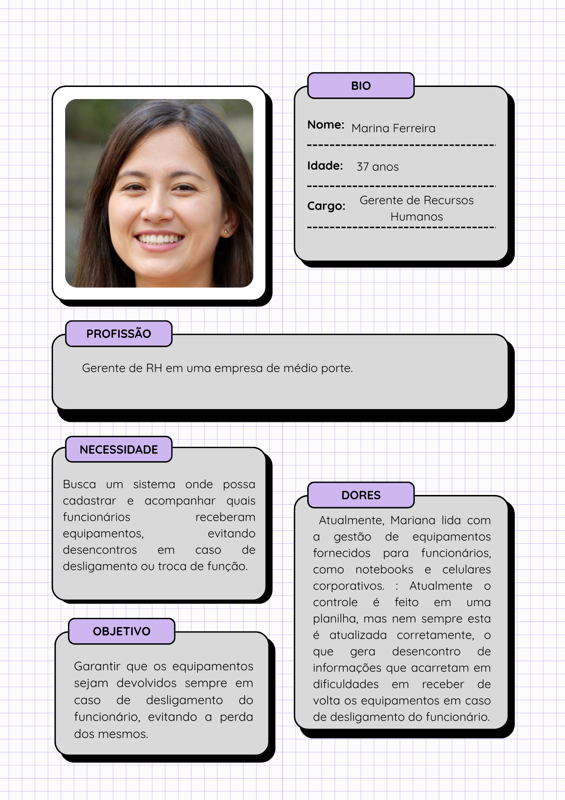
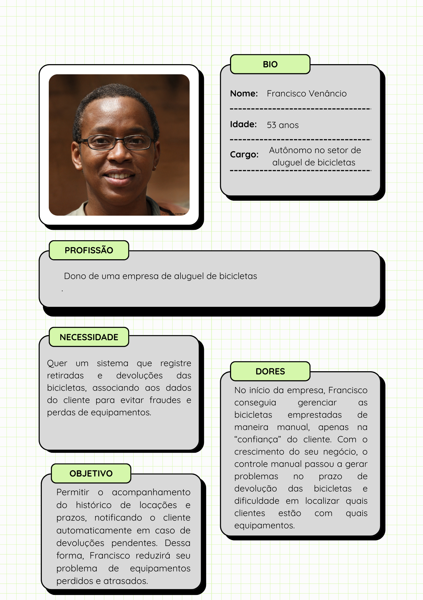

# Especificação do projeto

Pré-requisitos: <a href="01-Contexto.md"> Documentação de contexto</a>

Definição do problema e ideia de solução a partir da perspectiva do usuário. É composta pela definição do  diagrama de personas, histórias de usuários, requisitos funcionais e não funcionais além das restrições do projeto.

Apresente uma visão geral do que será abordado nesta parte do documento, enumerando as técnicas e/ou ferramentas utilizadas para realizar a especificações do projeto.

## Personas

Exemplo: _Pedro Paulo tem 26 anos, é arquiteto recém-formado e autônomo. Pensa em se desenvolver profissionalmente por meio de um mestrado fora do país, pois adora viajar, é solteiro e sempre quis fazer um intercâmbio. Está buscando uma agência que o ajude a encontrar universidades na Europa que aceitem alunos estrangeiros._

Enumere e detalhe as personas da sua solução. Para tanto, baseie-se tanto nos documentos disponibilizados na disciplina e/ou nos seguintes links:

> **Links úteis**:
> - [Rock content](https://rockcontent.com/blog/personas/)
> - [Hotmart](https://blog.hotmart.com/pt-br/como-criar-persona-negocio/)
> - [O que é persona?](https://resultadosdigitais.com.br/blog/persona-o-que-e/)
> - [Persona x público-alvo](https://flammo.com.br/blog/persona-e-publico-alvo-qual-a-diferenca/)
> - [Mapa de empatia](https://resultadosdigitais.com.br/blog/mapa-da-empatia/)
> - [Mapa de stalkeholders](https://www.racecomunicacao.com.br/blog/como-fazer-o-mapeamento-de-stakeholders/)
>
Lembre-se que você deve ser enumerar e descrever precisamente e personalizada todos os clientes ideais que sua solução almeja.

 

 <h4> Persona 1: João Mendes – Gerente de Produção </h4>
  <ul>
  <li>Idade: 42 anos</li>
  <li>Profissão: Gerente de Produção em uma indústria de equipamentos eletrônicos</li>
  <li>Dores: Tem dificuldades em acompanhar quais funcionários estão com quais ferramentas, pois tudo é controlado por planilhas e anotações manuais. A perda de equipamentos e o atraso na devolução geram prejuízos.</li>
  <li>Necessidade:Um sistema simples e automatizado que permita controlar as retiradas e devoluções de equipamentos de forma prática, com notificações e histórico de uso.</li>
  <li>Objetivo: Melhorar a gestão de recursos dentro da empresa, reduzindo perdas e tornando o controle mais eficiente.</li>
 </ul>

 
 
  
  
 

  <h4>Persona 2: Mariana Souza – Empreendedora de Biblioteca Comunitária</h4>
  <ul>
  <li>Idade: 35 anos</li>
  <li>Profissão: Proprietária de uma biblioteca comunitária que empresta livros físicos e digitais</li>
  <li>Dores: O controle dos empréstimos é feito em um caderno e algumas planilhas no computador, o que gera confusão e dificulta o acompanhamento das devoluções. Alguns usuários acabam ficando com os livros por muito tempo.</li>
  <li>Necessidade: Uma plataforma intuitiva onde possa registrar empréstimos e devoluções, com lembretes automáticos para os usuários.</li>
  <li>Objetivo: Garantir que os recursos (livros e e-books) sejam usados de forma eficiente e que os clientes tenham acesso facilitado a eles.</li>
 </ul>

  
  
   
  

  <h4>Persona 3: João Pereira – Supervisor de Assistência Técnica</h4>
   <ul>
  <li>Idade: 43 anos</li>
  <li>Profissão: Supervisor de assistência técnica em uma empresa de manutenção de celulares</li>
  <li>Dores: Muitas vezes não se segue uma ordem correta na manutenção dos aparelhos, o que gera um atraso na entrega ao cliente, gerando insatisfação. Além disso, já ocorreram casos de perda de aparelhos, o que gera grande prejuízo para a empresa.</li>
  <li>Necessidade: : Quer um sistema que registre cada entrada de aparelho, o técnico responsável e o prazo ao qual deve ser entregue de volta ao cliente, evitando atrasos e perdas.</li>
  <li>Objetivo: Garantir que os aparelhos sejam atendidos em um prazo eficiente e satisfatório, tanto para a empresa, quanto para o cliente, evitando sobrecargas e desencontro de informações.</li>
 </ul>

   
  

  <h4>Persona 4: Mariana Ferreira – Gerente de Recursos Humanos</h4>
   <ul>
  <li>Idade: 37 anos</li>
  <li>Profissão: Gerente de RH em uma empresa de médio porte</li>
  <li>Dores: Atualmente, Mariana lida com a gestão de equipamentos fornecidos para funcionários, como notebooks e celulares corporativos. : Atualmente o controle é feito em uma planilha, mas nem sempre esta é atualizada corretamente, o que gera desencontro de informações que acarretam em dificuldades em receber de volta os equipamentos em caso de desligamento do funcionário.</li>
  <li>Necessidade: : Busca um sistema onde possa cadastrar e acompanhar quais funcionários receberam equipamentos, evitando desencontros em caso de desligamento ou troca de função.</li>
  <li>Objetivo: Garantir que os equipamentos sejam devolvidos sempre em caso de desligamento do funcionário, evitando a perda dos mesmos.</li>
 </ul>

 

  
  

  <h4>Persona 5: Francisco Venâncio – Autônomo no setor de aluguel de bicicletas</h4>
   <ul>
  <li>Idade: 53 anos</li>
  <li>Profissão: : Dono de uma empresa de aluguel de bicicletas</li>
  <li>Dores: : No início da empresa, Francisco conseguia gerenciar as bicicletas emprestadas de maneira manual, apenas na “confiança” do cliente. Com o crescimento do seu negócio, o controle manual passou a gerar problemas no prazo de devolução das bicicletas e dificuldade em localizar quais clientes estão com quais equipamentos.</li>
  <li>Necessidade: : Quer um sistema que registre retiradas e devoluções das bicicletas, associando aos dados do cliente para evitar fraudes e perdas de equipamentos.</li>
  <li>Objetivo: Permitir o acompanhamento do histórico de locações e prazos, notificando o cliente automaticamente em caso de devoluções pendentes. Dessa forma, Francisco reduzirá seu problema de equipamentos perdidos e atrasados.</li>
 </ul>

 

</h4>

## Histórias de usuários

Com base na análise das personas, foram identificadas as seguintes histórias de usuários:

|EU COMO... `PERSONA`| QUERO/PRECISO ... `FUNCIONALIDADE` |PARA ... `MOTIVO/VALOR`                 |
|--------------------|------------------------------------|----------------------------------------|
|Usuário do sistema  | Registrar a retirada e devolução de equipamentos           | Garantir que as ferramentas estejam disponíveis e evitar perdas  |
|Usuário do sistema  | Cadastrar itens no sistema           | Facilitar o controle de empréstimos e disponibilidade               |
|Usuário do sistema  | Acompanhar histórico de empréstimos de cada usuário           | Identificar padrões de uso e tomar decisões sobre renovação de acervo      |
|Usuário do sistema  | Visualizar um histórico de movimentações de cada equipamento.        | Acompanhar trocas, devoluções e manutenções realizadas em cada equipamento.  |
|Usuário do sistema  | Registrar os dados de retirada e devolução no sistema.         | Garantir um maior controle de equipamentos disponíveis e já alocados.  |
|Administrador       | Criar categorias para diferentes tipos de recursos                | Facilitar a organização e busca dentro do sistema |
|Administrador       | Editar ou excluir registros de equipamentos e recursos                | Manter o banco de dados atualizado e organizado |
|Administrador       | Gerenciar permissões de usuários               | Controlar quem pode cadastrar, editar e visualizar dados no sistema |
|Administrador       | Cadastrar, remover e editar técnicos no sistema              | Garantir que só estejam no sistema técnicos atualmente credenciados pela empresa. |
|Administrador       | Definir regras para empréstimo e devolução de equipamentos, incluindo prazos.             | Garantir a padronização do processo e evitar falhas humanas. |
|Administrador       | Gerar relatórios de cada equipamento emprestado, quem está com o equipamento atualmente, etc.               | Garantir o controle das locações. |

Apresente aqui as histórias de usuários que são relevantes para o projeto da sua solução. As histórias de usuários consistem em uma ferramenta poderosa para a compreensão e elicitação dos requisitos funcionais e não funcionais da sua aplicação. Se possível, agrupe as histórias de usuários por contexto, para facilitar consultas recorrentes a esta parte do documento.

> **Links úteis**:
> - [Histórias de usuários com exemplos e template](https://www.atlassian.com/br/agile/project-management/user-stories)
> - [Como escrever boas histórias de usuário (user stories)](https://medium.com/vertice/como-escrever-boas-users-stories-hist%C3%B3rias-de-usu%C3%A1rios-b29c75043fac)
> - [User stories: requisitos que humanos entendem](https://www.luiztools.com.br/post/user-stories-descricao-de-requisitos-que-humanos-entendem/)
> - [Histórias de usuários: mais exemplos](https://www.reqview.com/doc/user-stories-example.html)
> - [9 common user story mistakes](https://airfocus.com/blog/user-story-mistakes/)

## Requisitos

As tabelas a seguir apresentam os requisitos funcionais e não funcionais que detalham o escopo do projeto. Para determinar a prioridade dos requisitos, aplique uma técnica de priorização e detalhe como essa técnica foi aplicada.

### Requisitos funcionais

| ID    | Descrição do Requisito  | Prioridade |
|------|-----------------------------------------|----|
| RF-001 | A empresa deve criar um usuário e senha. | ALTA | 
| RF-002 | A empresa deve conseguir fazer login com seu usuário e senha. | ALTA |
| RF-003 | A empresa deve conseguir recuperar seus dados de login. | MÉDIA |
| RF-004 | A empresa deve conseguir criar departamentos de empréstimos. | ALTA |
| RF-005 | Cada departamento criado deve permitir a adição de produtos com código/nome únicos que serão emprestados, assim como a quantidade específica de cada objeto. | ALTA |
| RF-006 | Cada departamento criado deve permitir a adição de clientes (sejam internos ou externos), com código único, nome e CPF. | ALTA |
| RF-007 | O sistema deverá ter uma tela para realizar empréstimos, onde será necessário adicionar o código do cliente, o objeto, a quantidade de objetos e a data/hora do empréstimo, assim como a data e hora máxima para devolução. | ALTA |
| RF-008 | O sistema deverá registrar o código, nome e CPF do cliente, a quantidade de objetos emprestados, os objetos, a data/hora do empréstimo e a data/hora de devolução. | MÉDIA |
| RF-009 | O sistema deverá aceitar a devolução de produtos, onde será informado o código do cliente e o código do objeto. | ALTA |
| RF-010 | O sistema deverá mostrar a lista de objetos emprestados com o código do cliente em um dia específico. | ALTA |
| RF-011 | A empresa deverá conseguir editar o nome dos departamentos e dos objetos. | MÉDIA |
| RF-012 | A empresa deverá conseguir excluir departamentos e objetos. | MÉDIA |
| RF-013 | A empresa deverá conseguir apagar clientes. | MÉDIA |
| RF-014 | A empresa deverá conseguir editar o nome e o código do cliente. | MÉDIA |
| RF-015 | O sistema deverá permitir a exibição da lista de um determinado setor com produtos emprestados, mostrando o cliente, o produto, a data e a hora do empréstimo. | MÉDIA |
| RF-016 | O sistema poderá bloquear temporária ou permanentemente (a menos que seja revogado) um cliente de realizar empréstimos de um determinado setor/objeto. | BAIXA |
| RF-017 | O sistema deverá permitir a revogação do bloqueio de um cliente. | BAIXA |

### Requisitos não funcionais

|ID     | Descrição do Requisito  |Prioridade |
|-------|-------------------------|----|
|RNF-001| O sistema deve ser responsivo para rodar em dispositivos móveis | MÉDIA | 
|RNF-002| Deve processar as requisições do usuário em no máximo 3 segundos |  BAIXA | 

Com base nas histórias de usuários, enumere os requisitos da sua solução. Classifique esses requisitos em dois grupos:

- [Requisitos funcionais
 (RF)](https://pt.wikipedia.org/wiki/Requisito_funcional):
 correspondem a uma funcionalidade que deve estar presente na
  plataforma (ex: cadastro de usuário).
- [Requisitos não funcionais
  (RNF)](https://pt.wikipedia.org/wiki/Requisito_n%C3%A3o_funcional):
  correspondem a uma característica técnica, seja de usabilidade,
  desempenho, confiabilidade, segurança ou outro (ex: suporte a
  dispositivos iOS e Android).

Lembre-se de que cada requisito deve corresponder a uma e somente uma característica-alvo da sua solução. Além disso, certifique-se de que todos os aspectos capturados nas histórias de usuários foram cobertos.

> **Links úteis**:
> - [O que são requisitos funcionais e requisitos não funcionais?](https://codificar.com.br/requisitos-funcionais-nao-funcionais/)
> - [Entenda o que são requisitos de software, a diferença entre requisito funcional e não funcional, e como identificar e documentar cada um deles](https://analisederequisitos.com.br/requisitos-funcionais-e-requisitos-nao-funcionais-o-que-sao/)

## Restrições

Enumere as restrições à sua solução. Lembre-se de que as restrições geralmente limitam a solução candidata.

O projeto está restrito aos itens apresentados na tabela a seguir.

|ID| Restrição                                             |
|--|-------------------------------------------------------|
|001| O projeto deverá ser entregue até o final do semestre |
|002| O custo total do projeto não deve exceder o orçamento definido       |

## Diagrama de casos de uso

O diagrama de casos de uso é o próximo passo após a elicitação de requisitos. Ele utiliza um modelo gráfico e uma tabela com as descrições sucintas dos casos de uso e dos atores. O diagrama contempla a fronteira do sistema e o detalhamento dos requisitos funcionais, com a indicação dos atores, casos de uso e seus relacionamentos.

As referências abaixo irão auxiliá-lo na geração do artefato “diagrama de casos de uso”.

> **Links úteis**:
> - [Criando casos de uso](https://www.ibm.com/docs/pt-br/engineering-lifecycle-management-suite/design-rhapsody/10.0?topic=cases-creating-use)
> - [Como criar diagrama de caso de uso: tutorial passo a passo](https://gitmind.com/pt/fazer-diagrama-de-caso-uso.html/)
> - [Lucidchart](https://www.lucidchart.com/)
> - [Astah](https://astah.net/)
> - [Diagrams](https://app.diagrams.net/)
