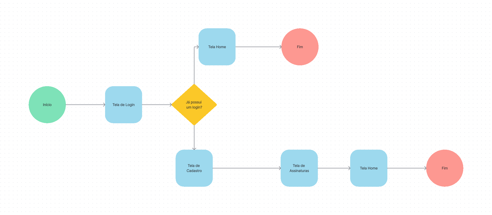
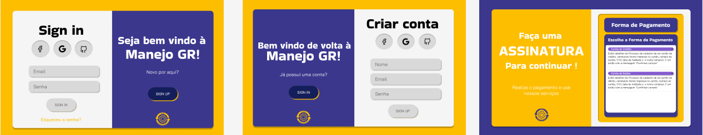
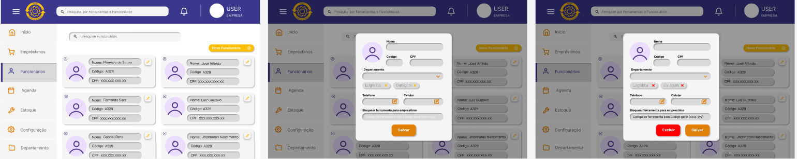
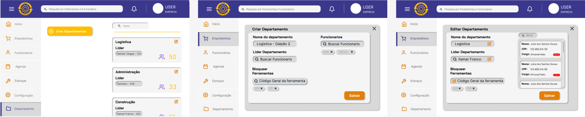

# Projeto de interface

Pré-requisitos: <a href="02-Especificacao.md"> Especificação do projeto</a>

Visão geral da interação do usuário pelas telas do sistema e protótipo interativo das telas com as funcionalidades que fazem parte do sistema (wireframes).

 Apresente as principais interfaces da plataforma. Discuta como ela foi elaborada de forma a atender os requisitos funcionais, não funcionais e histórias de usuário abordados na <a href="02-Especificacao.md"> Especificação do projeto</a>.

 ## User flow

### Diagrama de fluxo

## Wireframes

 

## Interface do sistema

Visão geral da interação do usuário por meio das telas do sistema. Apresente as principais interfaces da plataforma em sua versão final.

### Tela principal do sistema

Na tela principal, o usuário terá acesso a menus rápidos com as ferramentas e funcionários, além de uma agenda.

![Tela-Home]

###  Telas de Emprestimo

Na tela inicial de Empréstimo, o usuário tem acesso aos menus e a um aviso de empréstimos em atraso.

Na tela de Listar Empréstimos, o usuário consegue ver e filtrar todos os empréstimos que estão ativos, além de conseguir devolvê-los.

### Telas de Compra de Ferramentas

Após a compra de ferramentas, o usuário pode adicioná-las no estoque.

O usuário consegue ver e editar todas as ferramentas que estão no estoque, assim como ver o histórico de uso de cada uma.

