# Projeto de interface

Pré-requisitos: <a href="02-Especificacao.md"> Especificação do projeto</a>

Visão geral da interação do usuário pelas telas do sistema e protótipo interativo das telas com as funcionalidades que fazem parte do sistema (wireframes).

 Apresente as principais interfaces da plataforma. Discuta como ela foi elaborada de forma a atender os requisitos funcionais, não funcionais e histórias de usuário abordados na <a href="02-Especificacao.md"> Especificação do projeto</a>.

 ## User flow
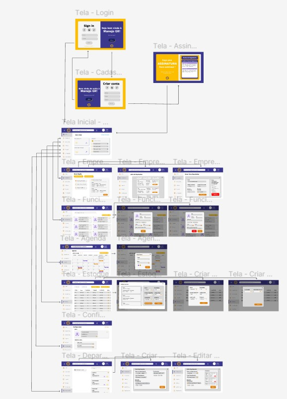

### Diagrama de fluxo

O diagrama apresenta o estudo do fluxo de interação do usuário com o sistema interativo, muitas vezes sem a necessidade de desenhar o design das telas da interface. Isso permite que o design das interações seja bem planejado e tenha impacto na qualidade do design do wireframe interativo que será desenvolvido logo em seguida.

O diagrama de fluxo pode ser desenvolvido com “boxes” que possuem, internamente, a indicação dos principais elementos de interface — tais como menus e acessos — e funcionalidades, como editar, pesquisar, filtrar e configurar, além da conexão entre esses boxes a partir do processo de interação.

## Wireframes

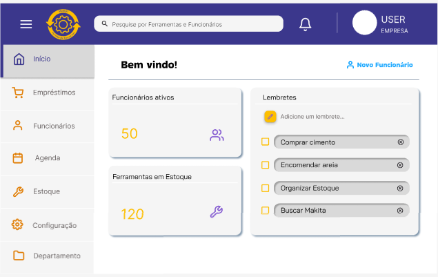
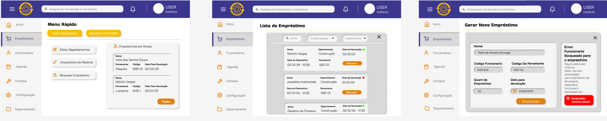
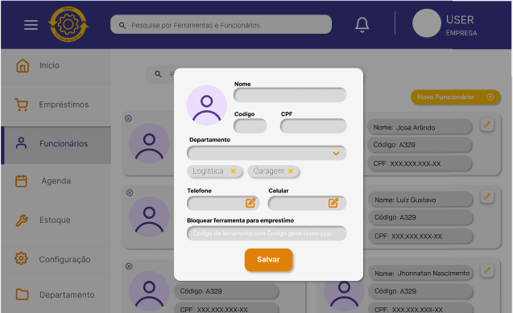
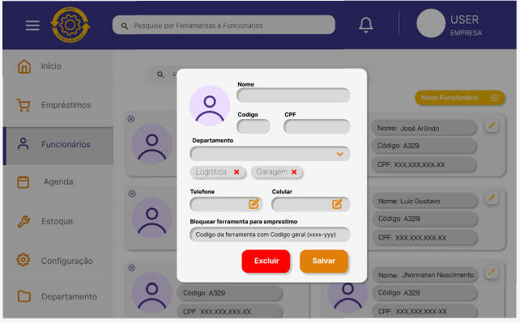
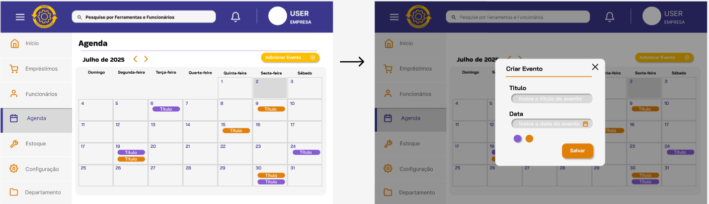
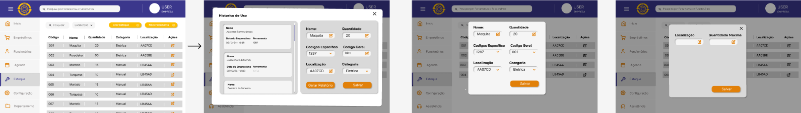
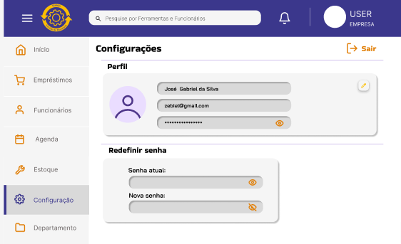
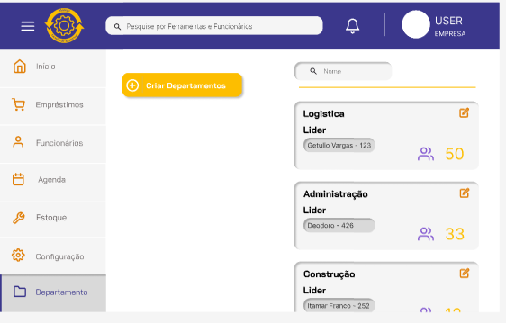
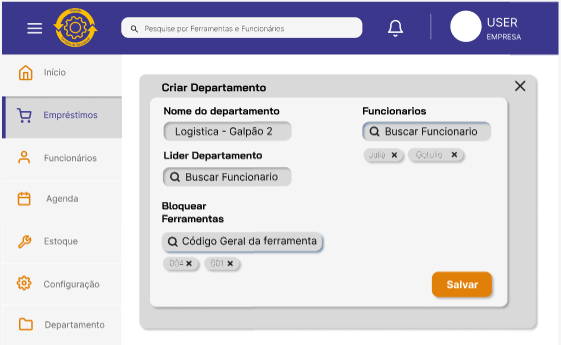
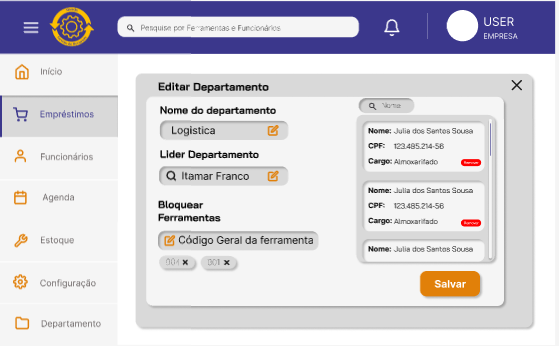
 

## Interface do sistema

Visão geral da interação do usuário por meio das telas do sistema. Apresente as principais interfaces da plataforma em sua versão final.

### Tela principal do sistema

Descrição da tela principal do sistema.

> Insira aqui a tela principal do sistema

###  Telas do processo 1

Descrição da tela relativa à atividade 1 do processo 1.

> Insira aqui a tela da atividade 1

Descrição da tela relativa à atividade 2 do processo 1.

> Insira aqui a tela da atividade 2

### Telas do processo 2

Descrição da tela relativa à atividade 1 do processo 2.

> Insira aqui a tela da atividade 1

Descrição da tela relativa à atividade 2 do processo 2.

> Insira aqui a tela da atividade 2
