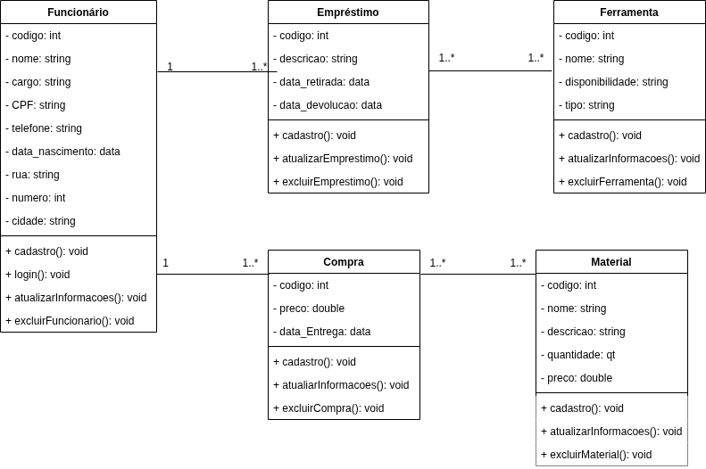
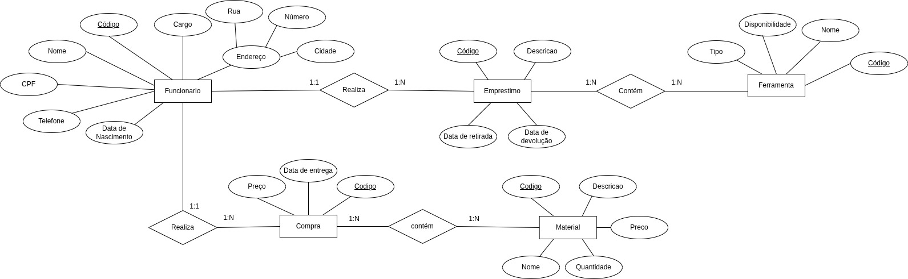
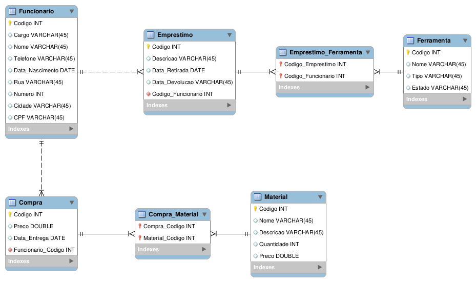

# Arquitetura da solução

<span style="color:red">Pré-requisitos: <a href="05-Projeto-interface.md"> Projeto de interface</a></span>

Definição de como o software é estruturado em termos dos componentes que fazem parte da solução e do ambiente de hospedagem da aplicação.


## Diagrama de classes



## Jornada do usuário

Jornada de Empréstimo de Materiais


##  Modelo de dados

### Modelo ER

### Esquema relacional


---
### Modelo físico

```sql
-- MySQL Script generated by MySQL Workbench
-- qui 08 mai 2025 01:35:25
-- Model: New Model    Version: 1.0
-- MySQL Workbench Forward Engineering

SET @OLD_UNIQUE_CHECKS=@@UNIQUE_CHECKS, UNIQUE_CHECKS=0;
SET @OLD_FOREIGN_KEY_CHECKS=@@FOREIGN_KEY_CHECKS, FOREIGN_KEY_CHECKS=0;
SET @OLD_SQL_MODE=@@SQL_MODE, SQL_MODE='ONLY_FULL_GROUP_BY,STRICT_TRANS_TABLES,NO_ZERO_IN_DATE,NO_ZERO_DATE,ERROR_FOR_DIVISION_BY_ZERO,NO_ENGINE_SUBSTITUTION';

-- -----------------------------------------------------
-- Schema mydb
-- -----------------------------------------------------

-- -----------------------------------------------------
-- Schema mydb
-- -----------------------------------------------------
CREATE SCHEMA IF NOT EXISTS `mydb` DEFAULT CHARACTER SET utf8 ;
USE `mydb` ;

-- -----------------------------------------------------
-- Table `mydb`.`Ferramenta`
-- -----------------------------------------------------
CREATE TABLE IF NOT EXISTS `mydb`.`Ferramenta` (
  `Codigo` INT NULL,
  `Nome` VARCHAR(45) NULL,
  `Tipo` VARCHAR(45) NULL,
  `Disponibilidade` VARCHAR(45) NULL,
  PRIMARY KEY (`Codigo`))
ENGINE = InnoDB;


-- -----------------------------------------------------
-- Table `mydb`.`Funcionario`
-- -----------------------------------------------------
CREATE TABLE IF NOT EXISTS `mydb`.`Funcionario` (
  `Codigo` INT NOT NULL,
  `Cargo` VARCHAR(45) NULL,
  `Nome` VARCHAR(45) NULL,
  `Telefone` VARCHAR(45) NULL,
  `Data_Nascimento` DATE NULL,
  `Rua` VARCHAR(45) NULL,
  `Numero` INT NULL,
  `Cidade` VARCHAR(45) NULL,
  `CPF` VARCHAR(45) NULL,
  PRIMARY KEY (`Codigo`))
ENGINE = InnoDB;


-- -----------------------------------------------------
-- Table `mydb`.`Emprestimo`
-- -----------------------------------------------------
CREATE TABLE IF NOT EXISTS `mydb`.`Emprestimo` (
  `Codigo` INT NULL,
  `Descricao` VARCHAR(45) NULL,
  `Data_Retirada` DATE NULL,
  `Data_Devolucao` VARCHAR(45) NULL,
  `Codigo_Funcionario` INT NOT NULL,
  PRIMARY KEY (`Codigo`),
  INDEX `fk_Emprestimo_Funcionario_idx` (`Codigo_Funcionario` ASC) VISIBLE,
  CONSTRAINT `fk_Emprestimo_Funcionario`
    FOREIGN KEY (`Codigo_Funcionario`)
    REFERENCES `mydb`.`Funcionario` (`Codigo`)
    ON DELETE NO ACTION
    ON UPDATE NO ACTION)
ENGINE = InnoDB;


-- -----------------------------------------------------
-- Table `mydb`.`Emprestimo_Ferramenta`
-- -----------------------------------------------------
CREATE TABLE IF NOT EXISTS `mydb`.`Emprestimo_Ferramenta` (
  `Codigo_Emprestimo` INT NOT NULL,
  `Codigo_Funcionario` INT NOT NULL,
  PRIMARY KEY (`Codigo_Emprestimo`, `Codigo_Funcionario`),
  INDEX `fk_Emprestimo_has_Ferramenta_Ferramenta1_idx` (`Codigo_Funcionario` ASC) VISIBLE,
  INDEX `fk_Emprestimo_has_Ferramenta_Emprestimo1_idx` (`Codigo_Emprestimo` ASC) VISIBLE,
  CONSTRAINT `fk_Emprestimo_has_Ferramenta_Emprestimo1`
    FOREIGN KEY (`Codigo_Emprestimo`)
    REFERENCES `mydb`.`Emprestimo` (`Codigo`)
    ON DELETE NO ACTION
    ON UPDATE NO ACTION,
  CONSTRAINT `fk_Emprestimo_has_Ferramenta_Ferramenta1`
    FOREIGN KEY (`Codigo_Funcionario`)
    REFERENCES `mydb`.`Ferramenta` (`Codigo`)
    ON DELETE NO ACTION
    ON UPDATE NO ACTION)
ENGINE = InnoDB;


-- -----------------------------------------------------
-- Table `mydb`.`Compra`
-- -----------------------------------------------------
CREATE TABLE IF NOT EXISTS `mydb`.`Compra` (
  `Codigo` INT NOT NULL,
  `Preco` DOUBLE NULL,
  `Data_Entrega` DATE NULL,
  `Funcionario_Codigo` INT NOT NULL,
  PRIMARY KEY (`Codigo`),
  INDEX `fk_Compra_Funcionario1_idx` (`Funcionario_Codigo` ASC) VISIBLE,
  CONSTRAINT `fk_Compra_Funcionario1`
    FOREIGN KEY (`Funcionario_Codigo`)
    REFERENCES `mydb`.`Funcionario` (`Codigo`)
    ON DELETE NO ACTION
    ON UPDATE NO ACTION)
ENGINE = InnoDB;


-- -----------------------------------------------------
-- Table `mydb`.`Material`
-- -----------------------------------------------------
CREATE TABLE IF NOT EXISTS `mydb`.`Material` (
  `Codigo` INT NOT NULL,
  `Nome` VARCHAR(45) NULL,
  `Descricao` VARCHAR(45) NULL,
  `Quantidade` INT NULL,
  `Preco` DOUBLE NULL,
  PRIMARY KEY (`Codigo`))
ENGINE = InnoDB;


-- -----------------------------------------------------
-- Table `mydb`.`Compra_Material`
-- -----------------------------------------------------
CREATE TABLE IF NOT EXISTS `mydb`.`Compra_Material` (
  `Compra_Codigo` INT NOT NULL,
  `Material_Codigo` INT NOT NULL,
  PRIMARY KEY (`Compra_Codigo`, `Material_Codigo`),
  INDEX `fk_Compra_has_Material_Material1_idx` (`Material_Codigo` ASC) VISIBLE,
  INDEX `fk_Compra_has_Material_Compra1_idx` (`Compra_Codigo` ASC) VISIBLE,
  CONSTRAINT `fk_Compra_has_Material_Compra1`
    FOREIGN KEY (`Compra_Codigo`)
    REFERENCES `mydb`.`Compra` (`Codigo`)
    ON DELETE NO ACTION
    ON UPDATE NO ACTION,
  CONSTRAINT `fk_Compra_has_Material_Material1`
    FOREIGN KEY (`Material_Codigo`)
    REFERENCES `mydb`.`Material` (`Codigo`)
    ON DELETE NO ACTION
    ON UPDATE NO ACTION)
ENGINE = InnoDB;


SET SQL_MODE=@OLD_SQL_MODE;
SET FOREIGN_KEY_CHECKS=@OLD_FOREIGN_KEY_CHECKS;
SET UNIQUE_CHECKS=@OLD_UNIQUE_CHECKS;

```
Esse script deverá ser incluído em um arquivo .sql na pasta [de scripts SQL](../src/db).


## Tecnologias

Descreva qual(is) tecnologias você vai usar para resolver o seu problema, ou seja, implementar a sua solução. Liste todas as tecnologias envolvidas, linguagens a serem utilizadas, serviços web, frameworks, bibliotecas, IDEs de desenvolvimento, e ferramentas.

Apresente também uma figura explicando como as tecnologias estão relacionadas ou como uma interação do usuário com o sistema vai ser conduzida, por onde ela passa até retornar uma resposta ao usuário.


| **Dimensão**   | **Tecnologia**  |
| ---            | ---             |
| Front-end      | HTML + CSS + JS + React |
| Back-end       | Node.js         |
| SGBD           | MySQL           |
| Deploy         | Vercel          |


## Hospedagem

Explique como a hospedagem e o lançamento da plataforma foram realizados.

> **Links úteis**:
> - [Website com GitHub Pages](https://pages.github.com/)
> - [Programação colaborativa com Repl.it](https://repl.it/)
> - [Getting started with Heroku](https://devcenter.heroku.com/start)
> - [Publicando seu site no Heroku](http://pythonclub.com.br/publicando-seu-hello-world-no-heroku.html)

## Qualidade de software

Conceituar qualidade é uma tarefa complexa, mas ela pode ser vista como um método gerencial que, por meio de procedimentos disseminados por toda a organização, busca garantir um produto final que satisfaça às expectativas dos stakeholders.

No contexto do desenvolvimento de software, qualidade pode ser entendida como um conjunto de características a serem atendidas, de modo que o produto de software atenda às necessidades de seus usuários. Entretanto, esse nível de satisfação nem sempre é alcançado de forma espontânea, devendo ser continuamente construído. Assim, a qualidade do produto depende fortemente do seu respectivo processo de desenvolvimento.

A norma internacional ISO/IEC 25010, que é uma atualização da ISO/IEC 9126, define oito características e 30 subcaracterísticas de qualidade para produtos de software. Com base nessas características e nas respectivas subcaracterísticas, identifique as subcaracterísticas que sua equipe utilizará como base para nortear o desenvolvimento do projeto de software, considerando alguns aspectos simples de qualidade. Justifique as subcaracterísticas escolhidas pelo time e elenque as métricas que permitirão à equipe avaliar os objetos de interesse.

> **Links úteis**:
> - [ISO/IEC 25010:2011 - Systems and Software Engineering — Systems and Software Quality Requirements and Evaluation (SQuaRE) — System and Software Quality Models](https://www.iso.org/standard/35733.html/)
> - [Análise sobre a ISO 9126 – NBR 13596](https://www.tiespecialistas.com.br/analise-sobre-iso-9126-nbr-13596/)
> - [Qualidade de software - Engenharia de Software](https://www.devmedia.com.br/qualidade-de-software-engenharia-de-software-29/18209)
