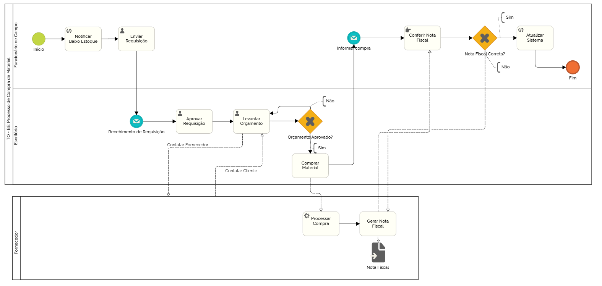

### 3.3.2 Processo 2 – TO - BE PROCESSO DE COMPRA DE MATERIAL
 
Processo de compra de material. Esse é o TO-BE (Processo que desejamos implementar). É de extremo interesse melhorar o processo da empresa no que diz respeito a automação, e principalmente, rastreabilidade do processo. Pra isso, desejamos implementar uma verificação de baixo estoque, além de automatizar o processo, que atualmente é feito sem um sistema único.

#### Detalhamento das atividades

**Atividade 1 - Enviar Requisição**

| **Campo**       | **Tipo**         | **Restrições** | **Valor default** |
| ---             | ---              | ---            | ---               |
| nome_solic      | Caixa de Texto   |  Obrigatório   |                   |
|   |                  |                |                   |
| telefone        | Caixa de Texto   | formato (99)999999999|             |
| data           | Data   | Formato DD/MM/YYYY | Data atual          |
| senha           | Caixa de Texto   | mínimo de 8 caracteres |           |
| descrição           | Caixa de Texto   | Obrigatório |           |

| **Comandos**         |  **Destino**                   | **Tipo** |
| ---                  | ---                            | ---               |
| enviar | Recebimento da requisição | default |

**Atividade 2 - Aprovar Requisição**

| **Campo**       | **Tipo**         | **Restrições** | **Valor default** |
| ---             | ---              | ---            | ---               |
| aprovacao | Seleção única  |   Obrigatório             |                   |

| **Comandos**         |  **Destino**                   | **Tipo**          |
| ---                  | ---                            | ---               |
| Aprovar | Levantar orçamento  | default |
|                      |                                |                   |

**Atividade 3 - Levantar Orçamento**

| **Campo**       | **Tipo**         | **Restrições** | **Valor default** |
| ---             | ---              | ---            | ---               |
| dados_fornecedor | Tabela  |   Obrigatório             |                   |
| valor | Caixa de texto  |   Obrigatório             |                   |

| **Comandos**         |  **Destino**                   | **Tipo**          |
| ---                  | ---                            | ---               |
| Enviar | Exclusive (Orçamento Aprovado)  | default |
|                      |                                |                   |

**Atividade 3 - Comprar material**

| **Campo**       | **Tipo**         | **Restrições** | **Valor default** |
| ---             | ---              | ---            | ---               |
| dados_pagamento | Tabela  |   Obrigatório             |                   |

| **Comandos**         |  **Destino**                   | **Tipo**          |
| ---                  | ---                            | ---               |
| Enviar | Processar compra  | default |
|                      |                                |                   |

**Atividade 4 - Conferir nota fiscal**

| **Campo**       | **Tipo**         | **Restrições** | **Valor default** |
| ---             | ---              | ---            | ---               |
| validacao | Seleção única  |   Obrigatório             |                   |

| **Comandos**         |  **Destino**                   | **Tipo**          |
| ---                  | ---                            | ---               |
| Enviar | Exclusive (Nota fiscal correta?  | default |
|                      |                                |                   |

